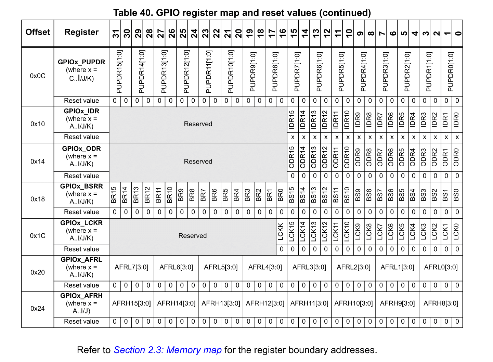
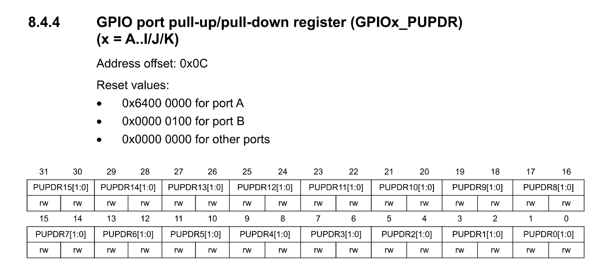
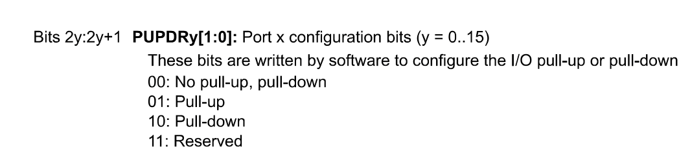

<h1 align="center"><span style="color:#33cccc"> Bare Metal Driver STM32 Programming Guide </span></h1>

<p align="center">
  
  
  
  
</p>

## Table of contents 📂

- [Introduction](#introduction)
- [Project Structure](#project-structure)
- [Memory Map and Registers](#memory-map-and-registers)

## Introduction

📝 This guide explains the fundamentals and helps you to understand how the gpio, i2c, spi, uart, timer, interrupt, and other peripherals driver works on the STM32F4xx series . The driver is written in C language and is based on the STM32F4xx reference manual.

📝 You can learn how to configure the STM32F4xx peripherals and how to use them to build your own embedded applications based on STM32F4xx series.

## Project Structure

|  Folder  |                                                                                                                                                              Description                                                                                                                                                               |
| :------: | :------------------------------------------------------------------------------------------------------------------------------------------------------------------------------------------------------------------------------------------------------------------------------------------------------------------------------------: |
|  Driver  |                                                           Contains the driver source code for STM32F4xx series in the drivers 📂 folder: <br> <strong> - </strong> Inc: All header (.h) files of the driver <br> <strong> - </strong> Src: All src (.c) files of the driver                                                            |
| Document | Contains the documents of the driver (I will explain these documents through this guide): <br> <strong> - </strong> STM32F4xx Reference Manual <br> <strong> - </strong> STM32F4xx Datasheet <br> <strong> - </strong> STM32F4xx User Manual <br> <strong> - </strong> STM32F4xx Datasheet <br> <strong> - </strong> Cortex M4 Devices |

## Memory Map And Registers

- From the section 2 of the reference manual, you can find the memory map of the STM32F4xx series. But, wait a minute, what is the memory map? 🤔
- The memory map is a map of the memory regions that are available in the microcontroller. The memory map is divided into different memory regions through <strong>bus interfaces</strong>. Each <strong>bus interfaces</strong> is connected to the <strong>different peripherals</strong> of the microcontroller.

- For example, the AHB1 bus starts from 0x40020000 to 0x4007FFFF (You must read from bottom to top). The AHB1 bus is connected to the <strong>peripherals</strong> like GPIOA, GPIOB, RCC, etc:
    <p align="center">
  

- Each <strong>peripherals</strong> has its own 32-bit <strong>registers</strong>. Each <strong>register</strong> is used to configure the <strong>peripheral</strong> and to control the <strong>peripheral</strong>. For example, the GPIOA peripheral has 32-bit <strong>registers</strong> like GPIOX_PUDR, GPIOx_IDR, GPIOX_ODR etc:
  <p align="center">
  

- In each <strong>register</strong> has 32-bit <strong>fields</strong>. Each <strong>field</strong> is used to configure the <strong>peripheral</strong> and to control the <strong>peripheral</strong>. For example, the GPIOx_PUDR register has 32-bit <strong>fields</strong> from 0 to 31, each <strong>field</strong> contains 2-bits, and each <strong>field</strong> is used to configure the <strong>pin</strong> of the <strong>GPIO</strong>, like PUDR0 is used to configure the <strong>pin 0 </strong>of the <strong>GPIO</strong>, PUDR1 is used to configure the <strong>pin 1</strong> of the <strong>GPIO</strong>, etc:
  <p align="center">
  

- You can config each field of the register by writing the value to the register. For example, if you want to configure the pin 0 of the GPIOA as an pull-up pin, you write 0 to bit 1 and 1 to bit 0 of the PUDR0[1:0]:
  <p align="center">
  

<!--
you must write the value 0x01 to the GPIOA_MODER register:
  ```c
  #define GPIOA_MODER 0x40020000
  #define GPIOA_MODER_PIN_0 0x01
  *(uint32_t*)GPIOA_MODER |= GPIOA_MODER_PIN_0;
  ``` -->

- The image below will visualize the simple memory map of the STM32F4xx series:
